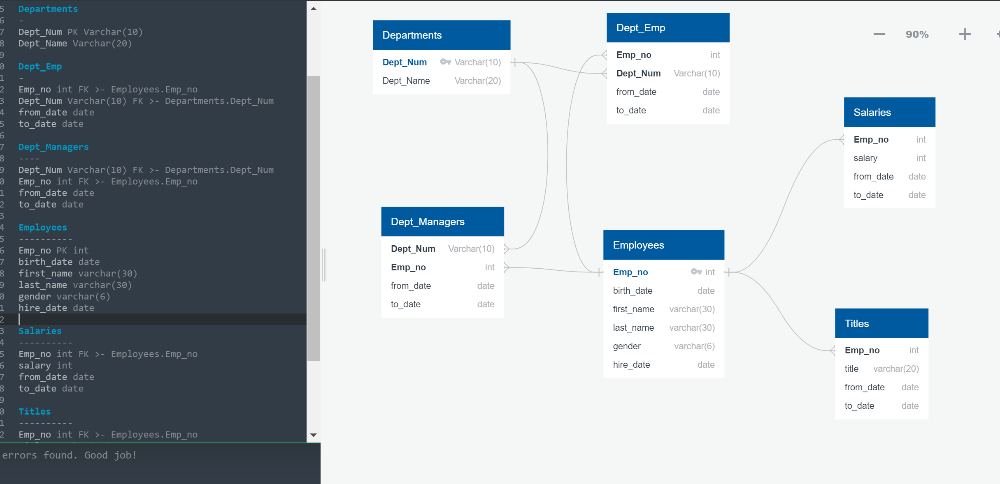

# SQL Employee Database

A relational database was created using SQL languange on PostgreSQL's PG Admin. 

An analysis was completed once data was loaded into the database tables.

#### Data Modeling

After Inspecting CSV files, and ERD diagram was created. Diagram was created Using [http://www.quickdatabasediagrams.com](http://www.quickdatabasediagrams.com).

ERD Model Screenshot

#### Data Engineering

* A table schema was created for each of the six CSV files. 

* CSV files were imported into the corresponding SQL table.

#### Data Analysis

1. List of each employee: employee number, last name, first name, gender, and salary.

2. List of employees who were hired in 1986.

3. List of the manager of each department with the following information: department number, department name, the manager's employee number, last name, first name, and start and end employment dates.

4. List of the department of each employee with the following information: employee number, last name, first name, and department name.

5. List of all employees whose first name is "Hercules" and last names begin with "B."

6. List of all employees in the Sales department, including their employee number, last name, first name, and department name.

7. List of all employees in the Sales and Development departments, including their employee number, last name, first name, and department name.

8. In descending order, a list of the frequency count of employee last names, i.e., how many employees share each last name.
